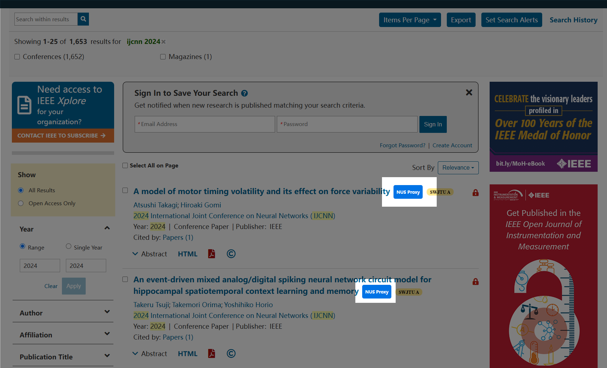

# nus-fast-library
Quickly convert publisher websites to NUS Library agency pages.

now support:
- [x] IEEE
  - Search
  - Article

- [x] CNKI
  - Search
  - Article

## How to use
- [x] download and import.
  1. [download](https://codeload.github.com/StanleySun233/nus-fast-library/zip/refs/heads/main).
  2. unzip it.
  3. open chrome.
  4. visit `chrome://extensions/`.
  5. press `Load unpacked` and select your unzip folder.
  6. use it.
- [ ] download at [Chrome Extension](chrome://extensions/)

## Sample

### IEEE

1. article

2. search

### CNKI

1. cnki document

2. cnki search

